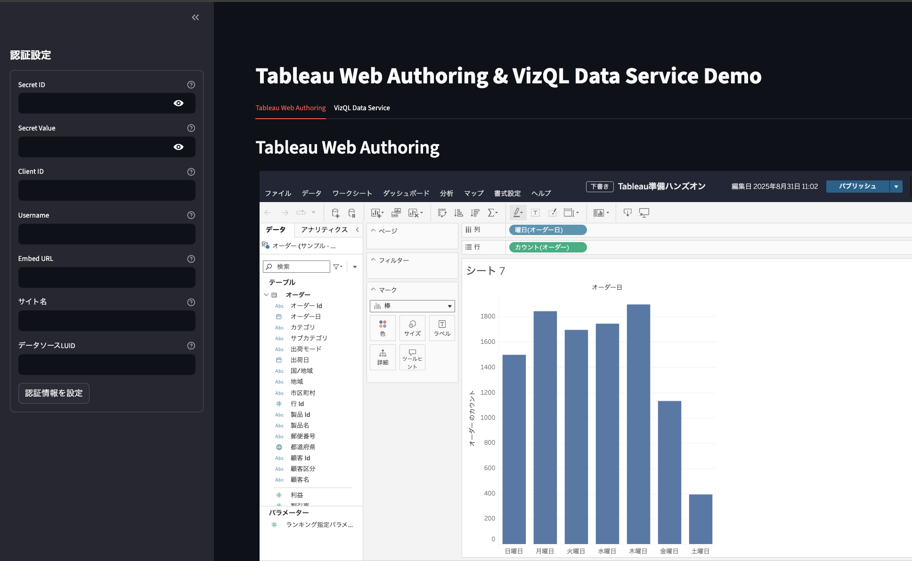
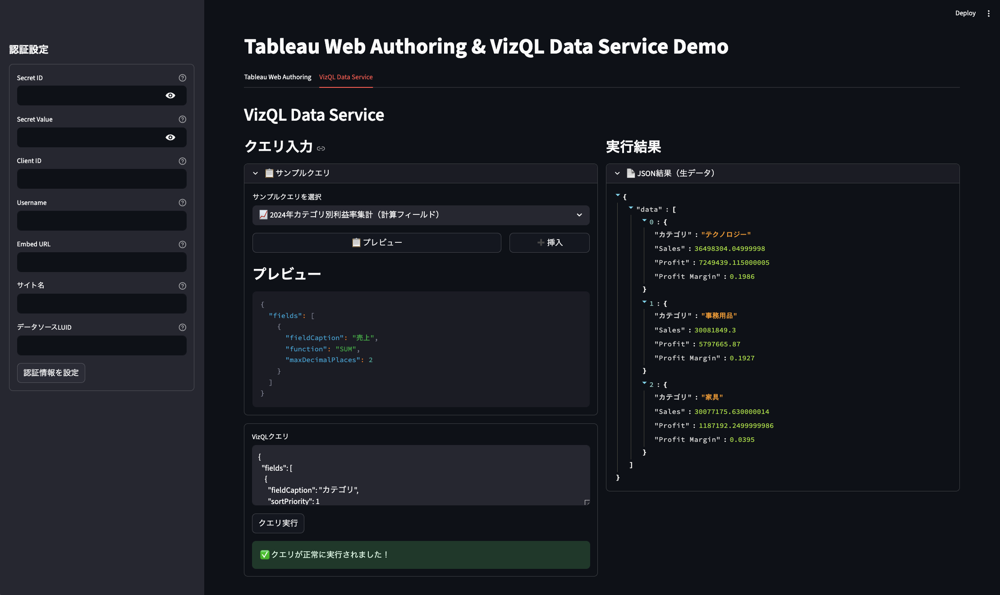

# Tableau VizQL Data Service Demo

Tableau Web AuthoringとVizQL Data Serviceの機能を統合したStreamlitデモアプリケーション。


## 機能

- **Tableau Web Authoring**: ブラウザ上でTableauビューの作成・編集
- **VizQL Data Service**: データソースに対するプログラマティックなクエリ実行
- **JWT認証**: Tableau Connected App認証

### Tableau Web Authoring


### VizQL Data Service


## アーキテクチャ

```
app.py              # メインアプリケーション
├── auth.py         # JWT認証・Tableau Server認証
├── vizql.py        # VizQLクエリ実行
├── ui_components.py # UI コンポーネント
└── config.py       # サンプルクエリ・設定
```

## セットアップ

### 必要な環境変数

`.env`ファイルを作成し、以下の値を設定してください：

```bash
TABLEAU_SECRET_ID=your_secret_id
TABLEAU_SECRET_VALUE=your_secret_value
TABLEAU_CLIENT_ID=your_client_id
TABLEAU_USERNAME=your_username
TABLEAU_EMBED_URL=https://your-server/t/sitename/views/workbook/view
TABLEAU_SITE_NAME=your_site_name
TABLEAU_DATASOURCE_LUID=your_datasource_luid
```

### インストール

```bash
pip install streamlit jwt requests python-dotenv pandas
```

### 実行

```bash
streamlit run app.py
```

## 使用方法

1. **認証設定**: サイドバーでTableau Connected Appの認証情報を入力
2. **Web Authoring**: タブ1でTableauビューの作成・編集
3. **VizQL Query**: タブ2でデータソースへのクエリ実行

## サンプルクエリ

- 売上集計
- 期間フィルタ付き売上集計
- 計算フィールド・ソート機能付きカテゴリ別利益率分析

## 必要なTableau設定

- Connected App の設定
- VizQL Data Service の有効化
- 適切なスコープ権限の付与
